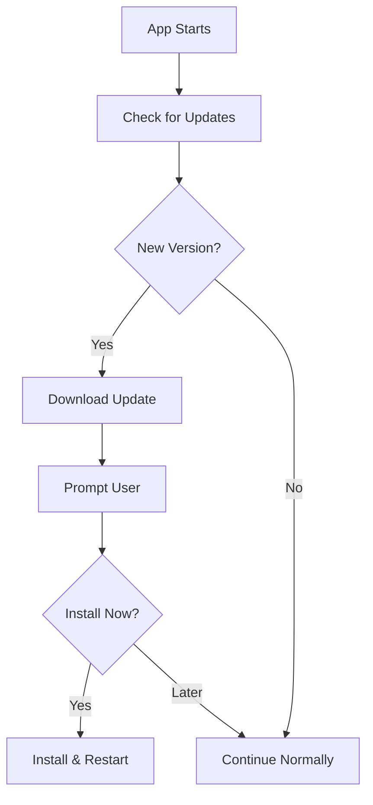

# Auto-Update Setup Guide

This document explains how to set up automatic updates for the Dealer Software desktop application.

## Overview

The desktop app uses Tauri's built-in updater plugin to check for and install updates automatically. Updates are distributed via GitHub Releases.

## How It Works

1. **Version Check**: App checks GitHub for new releases on startup
2. **Download**: If a new version is found, it downloads in the background
3. **Install**: User is prompted to install the update
4. **Verification**: Updates are cryptographically signed and verified before installation

## Update Flow



## Configuration

### Tauri Configuration

The updater is configured in `apps/desktop/src-tauri/tauri.conf.json`:

```json
{
  "plugins": {
    "updater": {
      "active": true,
      "endpoints": [
        "https://github.com/treyktw/dealer-applications/releases/latest/download/latest.json"
      ],
      "windows": {
        "installMode": "passive"
      },
      "pubkey": "YOUR_PUBLIC_KEY_HERE"
    }
  }
}
```

### GitHub Releases

Updates are published as GitHub Releases with the following structure:

```
Release v0.1.4
├── dealer-software_0.1.4_x64_en-US.msi (Windows)
├── dealer-software_0.1.4_x64.app.tar.gz (macOS Intel)
├── dealer-software_0.1.4_aarch64.app.tar.gz (macOS Apple Silicon)
├── dealer-software_0.1.4_amd64.deb (Linux Debian/Ubuntu)
├── dealer-software_0.1.4_amd64.AppImage (Linux Universal)
└── latest.json (Update manifest)
```

## Building and Publishing Updates

### Prerequisites

1. **Signing Key**: Generate a signing key pair:
   ```bash
   cd apps/desktop/src-tauri
   cargo install tauri-cli
   cargo tauri signer generate -w ~/.tauri/dealer-software.key
   ```

2. **GitHub Token**: Create a GitHub Personal Access Token with `repo` scope

3. **Environment Variables**:
   ```bash
   export TAURI_PRIVATE_KEY="your-private-key"
   export TAURI_KEY_PASSWORD="your-key-password"
   export GITHUB_TOKEN="your-github-token"
   ```

### Manual Build and Release

1. **Update Version**: Edit `apps/desktop/package.json` and `src-tauri/tauri.conf.json`

2. **Build**:
   ```bash
   cd apps/desktop
   pnpm tauri build
   ```

3. **Create Release**:
   - Go to GitHub Releases
   - Create new release with version tag (e.g., `v0.1.4`)
   - Upload all artifacts from `src-tauri/target/release/bundle/`
   - The updater will auto-generate `latest.json`

### Automated Build (GitHub Actions)

Create `.github/workflows/release-desktop.yml`:

```yaml
name: Release Desktop App

on:
  push:
    tags:
      - 'v*.*.*'

jobs:
  release:
    strategy:
      matrix:
        platform: [ubuntu-22.04, windows-latest, macos-latest]

    runs-on: ${{ matrix.platform }}

    steps:
      - uses: actions/checkout@v4

      - name: Setup Node.js
        uses: actions/setup-node@v4
        with:
          node-version: '20'

      - name: Install pnpm
        uses: pnpm/action-setup@v2
        with:
          version: 8

      - name: Setup Rust
        uses: dtolnay/rust-toolchain@stable

      - name: Install dependencies (Ubuntu)
        if: matrix.platform == 'ubuntu-22.04'
        run: |
          sudo apt-get update
          sudo apt-get install -y libgtk-3-dev libwebkit2gtk-4.1-dev librsvg2-dev

      - name: Install dependencies
        run: pnpm install

      - name: Build Desktop App
        run: |
          cd apps/desktop
          pnpm tauri build
        env:
          TAURI_PRIVATE_KEY: ${{ secrets.TAURI_PRIVATE_KEY }}
          TAURI_KEY_PASSWORD: ${{ secrets.TAURI_KEY_PASSWORD }}

      - name: Upload Release Assets
        uses: softprops/action-gh-release@v1
        with:
          files: apps/desktop/src-tauri/target/release/bundle/*/*
        env:
          GITHUB_TOKEN: ${{ secrets.GITHUB_TOKEN }}
```

## Update Checking in the App

### Frontend Implementation

Create a React component for update checking:

```typescript
// apps/desktop/src/hooks/useAutoUpdate.ts
import { check } from '@tauri-apps/plugin-updater';
import { relaunch } from '@tauri-apps/plugin-process';
import { useState, useEffect } from 'react';

export function useAutoUpdate() {
  const [updateAvailable, setUpdateAvailable] = useState(false);
  const [updateInfo, setUpdateInfo] = useState<any>(null);
  const [checking, setChecking] = useState(false);
  const [downloading, setDownloading] = useState(false);

  useEffect(() => {
    checkForUpdates();
  }, []);

  async function checkForUpdates() {
    setChecking(true);
    try {
      const update = await check();
      if (update) {
        setUpdateAvailable(true);
        setUpdateInfo({
          version: update.version,
          date: update.date,
          body: update.body,
        });
      }
    } catch (error) {
      console.error('Failed to check for updates:', error);
    } finally {
      setChecking(false);
    }
  }

  async function downloadAndInstall() {
    if (!updateAvailable) return;

    setDownloading(true);
    try {
      const update = await check();
      if (update) {
        await update.downloadAndInstall();
        await relaunch();
      }
    } catch (error) {
      console.error('Failed to install update:', error);
      setDownloading(false);
    }
  }

  return {
    updateAvailable,
    updateInfo,
    checking,
    downloading,
    checkForUpdates,
    downloadAndInstall,
  };
}
```

### Update UI Component

```typescript
// apps/desktop/src/components/UpdateNotification.tsx
import { useAutoUpdate } from '@/hooks/useAutoUpdate';
import { Button } from '@/components/ui/button';

export function UpdateNotification() {
  const { updateAvailable, updateInfo, downloading, downloadAndInstall } = useAutoUpdate();

  if (!updateAvailable) return null;

  return (
    <div className="fixed bottom-4 right-4 bg-card border rounded-lg p-4 shadow-lg max-w-md">
      <h3 className="font-semibold mb-2">Update Available</h3>
      <p className="text-sm text-muted-foreground mb-3">
        Version {updateInfo?.version} is now available.
      </p>
      {updateInfo?.body && (
        <div className="text-xs bg-muted p-2 rounded mb-3 max-h-24 overflow-y-auto">
          {updateInfo.body}
        </div>
      )}
      <div className="flex gap-2">
        <Button
          size="sm"
          onClick={downloadAndInstall}
          disabled={downloading}
        >
          {downloading ? 'Installing...' : 'Install Now'}
        </Button>
        <Button size="sm" variant="outline">
          Later
        </Button>
      </div>
    </div>
  );
}
```

## Update Manifest Format

The `latest.json` file contains update information:

```json
{
  "version": "0.1.4",
  "date": "2025-01-15T12:00:00Z",
  "platforms": {
    "windows-x86_64": {
      "url": "https://github.com/treyktw/dealer-applications/releases/download/v0.1.4/dealer-software_0.1.4_x64_en-US.msi",
      "signature": "..."
    },
    "darwin-x86_64": {
      "url": "https://github.com/treyktw/dealer-applications/releases/download/v0.1.4/dealer-software_0.1.4_x64.app.tar.gz",
      "signature": "..."
    },
    "darwin-aarch64": {
      "url": "https://github.com/treyktw/dealer-applications/releases/download/v0.1.4/dealer-software_0.1.4_aarch64.app.tar.gz",
      "signature": "..."
    },
    "linux-x86_64": {
      "url": "https://github.com/treyktw/dealer-applications/releases/download/v0.1.4/dealer-software_0.1.4_amd64.AppImage",
      "signature": "..."
    }
  }
}
```

## Security

1. **Signature Verification**: All updates are cryptographically signed
2. **HTTPS Only**: Updates are only downloaded over HTTPS
3. **Checksum Validation**: Downloaded files are verified before installation
4. **User Confirmation**: Users must approve installations

## Troubleshooting

### Update Check Fails

- **Check internet connection**
- **Verify GitHub repository is accessible**
- **Check if release exists with correct format**

### Signature Verification Fails

- **Ensure public key in tauri.conf.json matches private key used for signing**
- **Rebuild and re-sign the release**

### Update Won't Install

- **Check file permissions**
- **Try running as administrator (Windows)**
- **Check disk space**

## Best Practices

1. **Semantic Versioning**: Use `vX.Y.Z` format for releases
2. **Changelog**: Include release notes in GitHub Release description
3. **Testing**: Test updates on all platforms before release
4. **Rollback Plan**: Keep previous version available
5. **Gradual Rollout**: Consider staged rollouts for major updates

## Next Steps

1. Set up GitHub Actions workflow
2. Generate and configure signing keys
3. Create first release
4. Test update process
5. Monitor update adoption rates
